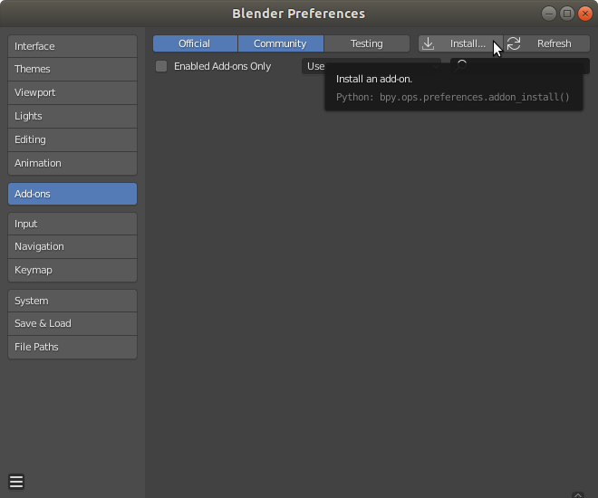

# 3DFace Blender Add-on

This is a lightweight and expressive generic head model learned from over 33,000 of accurately aligned 3D scans. This add-on allows you to add gender specific FLAME skinned meshes to your current Blender scene. The imported FLAME meshes consist of shape keys (blend shapes) for shape, expression and pose correctives as well as joints for manipulation of neck, jaw and eyes.

#### Add-on features:
+ Add gender specific FLAME mesh to current scene
+ Randomize/reset shape
+ Randomize/reset expression
+ Update joint locations
+ Enable/disable corrective poseshapes
+ Pose neck and jaw joints
+ 3D printing support: Make mesh watertight and export at proper scale

Requirements: Blender 2.80+

Additional Dependencies: None

## Data

Download the FLAME Blender Add-on from [MPI-IS/FLAME](http://flame.is.tue.mpg.de/). You need to sign up and agree to the model license (CC BY 4.0) for access to the model.

## Installation
1. Blender>Edit>Preferences>Add-ons>Install

2. Select flame_tool add-on ZIP file and install

3. Enable FLAME add-on

4. Enable sidebar in 3D Viewport>View>Sidebar

5. FLAME tool will show up in sidebar

## Usage

### Add gender specific FLAME mesh
+ Select gender and press "Add to scene" button to add model to origin
    + Note: If you cannot see the mesh then make sure that you have removed the default Blender cube at the origin since it will cover the FLAME model

